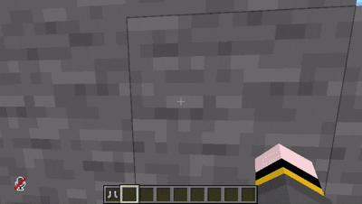
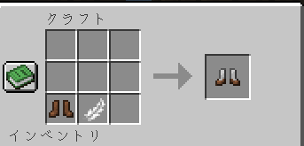
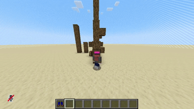
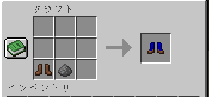
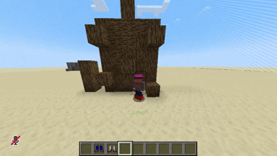
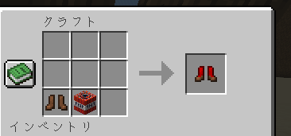

### 🌐 Language / 言語
English | [日本語](./README-jp.md)

---

# Sneak-Jump

## Plugin Description
Sneak-Jump is a Minecraft (Paper/Spigot) plugin that adds custom boots with unique abilities.  
It provides various aerial actions suited to your playstyle, such as double jumping and explosive launches powered by sneaking logic.

---

### 🌟 Added Boots

#### 1. Double Jump Boots
A basic pair of boots that allows you to perform an extra jump in mid-air. Ideal for smooth navigation and climbing high terrain.

* **Durability Cost:** `0` (Infinite uses)
* **Preview:** 
* **Crafting Recipe:** 

---

#### 2. Sneak Jump Boots
Boots that allow you to jump slightly higher by sneaking.

* **Durability Cost:** `1`
* **Preview:** 
* **Crafting Recipe:** 

---

#### 3. TNT Jump Boots
A high-powered pair of boots that charges TNT energy by tapping sneak repeatedly, allowing you to launch straight up into the air when you jump.

* **How to Use:** Tap Sneak repeatedly (Up to 5 charges) ➔ Jump to launch
* **Durability Cost:** `5` (13 uses per leather boots)
* **Preview:** 
* **Crafting Recipe:** 

---

## Download Plugin
[Download Latest Release](https://github.com/ringoame196-s-mcPlugin/Sneak-Jump/releases/latest)

## Commands
| Command | Description | Permission |
| --- | --- | --- |
| `/sneak-jump give <id>` | Gives you a custom boot item by ID (Alias: `/sjump`) | `sneak_jump.admin` |

## How to Use
1. Obtain custom boots using their respective crafting recipes or via the admin command (`/sneak-jump give <id>`).
2. Equip the boots in your feet slot.
3. Perform the specific action (Mid-air jump, Sneak, or Rapid Sneak + Jump) to trigger special abilities.
4. Each action consumes a specific amount of durability (0 / 1 / 5).

* **Note:** Damaged leather boots cannot be used as crafting ingredients. Fall damage caused by boot jump actions is automatically negated.

## Configuration (`config.yml`)
| Key | Description | Default Value |
| --- | --- | --- |
| `enable-crafting` | Whether to enable crafting recipes for custom boots | `true` |
| `names.double_jump_boots` | Display name for Double Jump Boots | `"&b&lDouble Jump Boots"` |
| `names.sneak_jump_boots` | Display name for Sneak Jump Boots | `"&a&lSneak Jump Boots"` |
| `names.tnt_jump_boots` | Display name for TNT Jump Boots | `"&c&lTNT Jump Boots"` |

## Environment
- Minecraft Version : 1.20.1
- Kotlin Version : 1.8.0

## Project Information
- Project Path : ringoame196-s-mcPlugin/Sneak-Jump.git
- Developer : ringoame196-s-mcPlugin
- Development Started : 2026-08-22